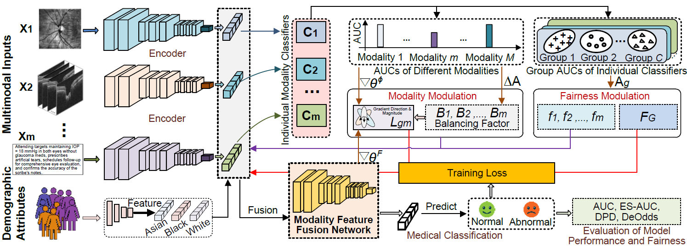

# MultiFair
This repository provides implementation codes for the **MultiFair** model. **MultiFair** (**Multi**modal Balanced **Fair**ness-Aware Medical Classification with Dual-Level Gradient Modulation) is a multimodal medical classification framework that tackles uneven learning across data modalities and unfair performance across demographic groups. By dynamically modulating training gradients at both levels, it achieves more balanced and fair predictions, outperforming existing multimodal and fairness methods. The concept behind the MultiFair model can be depicted with the following figure. 


# Installation 

```bash
conda create --name MultiFair python=3.10.16
pip install -r requirements.txt
```

# Datasets
We conducted experiments using two standard multimodal fairness-aware datasets: **FairVision** and **FairCLIP**.  
The [FairVision dataset](https://your-fairvision-link.com) and the [FairCLIP dataset](https://your-fairclip-link.com) are from Harvard-Ophthalmology-AI-Lab, and we used them with the necessary approvals.
### FairVision 
```
FairVision
|
├── Glaucoma
│   ├── train
│   ├── val
│   └── test
└── data_summary_glaucoma.csv
```
The `train/val/test` folders contain two types of data: SLO fundus images and NPZ files. NPZ files include OCT B-scans, SLO images, and additional attributes, so the dataloader only needs to read from NPZ files. File names follow the format slo_xxxxx.jpg for SLO images and `data_xxxxx.npz` for NPZ files, where `xxxxx (e.g., 07777)` is a unique ID.
