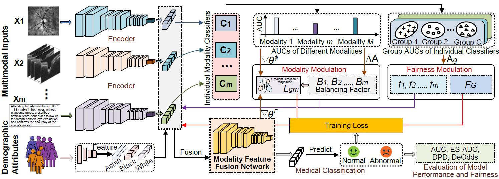

# MultiFair
> [**MultiFair: Multimodal Balanced Fairness-Aware Medical Classification with Dual-Level Gradient Modulation**](https://arxiv.org/pdf/2510.07328)
by Md Zubair, Hao Zheng, *Member, IEEE*, Jonathan Nussdorf, Grayson W. Armstrong, Lucy Q. Shen, Gabriela Wilson, Yu Tian, *Member, IEEE*, Xingquan Zhu, *Fellow, IEEE*, and Min Shi, *Member, IEEE*.


This repository provides implementation codes for the **MultiFair** model. **MultiFair** (**Multi**modal Balanced **Fair**ness-Aware Medical Classification with Dual-Level Gradient Modulation) is a multimodal medical classification framework that tackles uneven learning across data modalities and unfair performance across demographic groups. By dynamically modulating training gradients at both levels, it achieves more balanced and fair predictions, outperforming existing multimodal and fairness methods. The concept behind the MultiFair model can be depicted with the following figure. 



# Datasets
We conducted experiments using two standard multimodal fairness-aware datasets: **FairVision** and **FairCLIP**. The [FairVision dataset](https://your-fairvision-link.com) and the [FairCLIP dataset](https://your-fairclip-link.com) are from Harvard-Ophthalmology-AI-Lab, and we used them with the necessary approvals.
### FairVision 
```
FairVision
|
├── Glaucoma
│   ├── train
│   ├── val
│   └── test
└── data_summary_glaucoma.csv
```
The `train/val/test` folders contain 10000 samples with two types of data: SLO fundus images and NPZ files. NPZ files include OCT B-scans, SLO images, and additional attributes, so the dataloader only needs to read from NPZ files. File names follow the format slo_xxxxx.jpg for SLO images and `data_xxxxx.npz` for NPZ files, where `xxxxx (e.g., 07777)` is a unique ID.

### FairCLIP
```
FairCLIP
├── Testing
├── Training
├── Validation
├── data_summary.csv
├── gpt4_summarized_notes.csv
└── original_notes.csv
```
This dataset has also 10000 samples and `Training/Testing/Validation` folders' data structure is similar to FairVision but there is only SLO fundus images. The `.csv` files contains clinical notes of the patients. 

# Installation 
To install the prerequisites, please run the following commands: 
```bash
conda create --name MultiFair python=3.10.16
pip install -r requirements.txt
```

# Experiments 

## Model Training
To train the MultiFair Model on the FairVision dataset, run the following script:
```
python implementation/FairVision/multiFair_FairVision.py
```

To train the MultiFair Model on the FairCLIP dataset, run the following script:
```
python implementation/FairCLIP/multiFair_training.py
```

## Model Evaluation 
To find the evaluation metrics of the trained MultiFair model, execute the following scripts: 
```
# For FairVision dataset
python implementation/FairVision/fairvision_eval.py

# For FairCLIP dataset
python implementation/FairCLIP/fairclip_eval.py
```

# Acknowledgment and Citation

If you find our paper useful for your research, please cite our paper(https://arxiv.org/pdf/2510.07328). 
```bibtex
@article{zubair2025multifair,
  title={MultiFair: Multimodal Balanced Fairness-Aware Medical Classification with Dual-Level Gradient Modulation},
  author={Zubair, Md and Zheng, Hao and Jonathan, Nussdorf and Armstrong, Grayson W and Shen, Lucy Q and Wilson, Gabriela and Tian, Yu and Zhu, Xingquan and Shi, Min},
  journal={arXiv preprint arXiv:2510.07328},
  year={2025}
}


